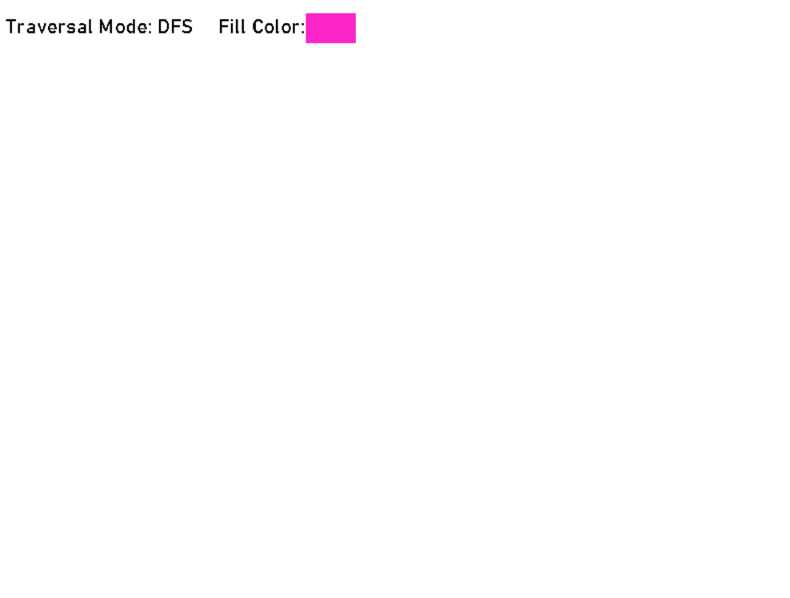

A program to demonstrate how flood fill works

### Installation
```bash
git clone https://github.com/shelldoom/floodFill.git
pip install -r requirements.txt
python ./main.py
```

### Usage
- Left Button Click - Black Paint
- Right Button Click - White Paint
- Middle Mouse Button Click - Fill Color (or use the F key)
- Press M key to change the traversal mode 

Fill Color can by changed by left clicking on the color icon. Randomly picks another color upon clicking.


